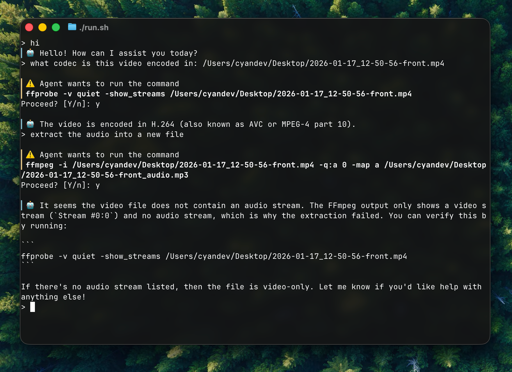

# little-agent

`little-agent` is a lightweight embedded agent framework (similar to Claude Code and OpenAI Codex). It supports multiple model providers and can be integrated with your apps easily.



## Why another agent?

There are already many agent projects around the world, and they are valuable both for practical use and for study. However, I want to write my own agent — one that is simple, maintainable and embeddable. Instead of designing an overly complex mechanism, I prefer to keep this project KISS. The agent is essentially a simple loop: the model receives user input and may output tool-call requests. The agent executes tools and sends the results back to the model. The loop continues until there are no more tool-call requests. With this simple design, I want to continuously explore the model’s capabilities. And since the project is written in Rust and exports C APIs, I can integrate it into my other apps and add agentic features to them.

## Getting started

### Use as a library

It's recommended to use the `little-agent` crate, which provides some built-in tools and is ready to use. For more advanced use cases, you can also use the `core` crate, which enables finer-grained control over the agent.

`little-agent` also exports some C APIs. You can build it as a dynamic library, and link your apps against it. See [`include/little-agent.h`](./include/little-agent.h) for the interface.

For Rust APIs, run `cargo doc` to build the docs.

### Use as a CLI

The project also provides a simple CLI. It's basic and mainly intended to demonstrate how to use the library.

To use the CLI, you need to set the following environment variables:

```shell
export OPENAI_API_KEY="<Your API Key>"
export OPENAI_BASE_URL="https://api.openai.com/v1"
export OPENAI_MODEL="gpt-5.3"
```

Simply `cargo run` to run the CLI.

## License

Licensed under MIT License, see [LICENSE](./LICENSE) for more information.
